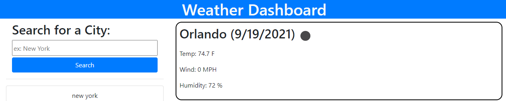
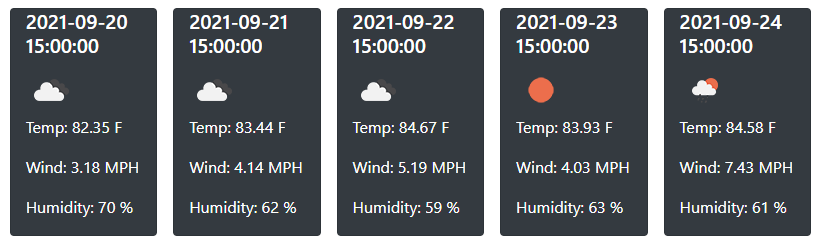
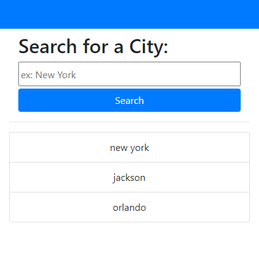

# Weather Forecasr App

With this weather application, users will be able to check the weather for any US city and plan a trip or vacation as well as get accurate data about the weather in the city the user searched for.

## check the weather of any US city with a quick search

With this search menu, the user is able to type in a city and then the app will make an api call to the open weather api to get weather by city and when the data is returned we will display specific data to the screen for the user to see. The same button click will also trigger the api call for the 5 day forecast, and when returned the data will be used to display the specific information on the screen for the user.

## 5 Day Forecast

The 5 Day forecast displays 5 cards, one for each date. In each card, the date, weather icon, temperature, wind speed and humidity are displayed on each card, and the info matches each date it is displayed for.

## search history

Each time a user searches for a city, the city is then saved to an array inside an object that gets push to local storage. The screen is then updated with the city they just searched, and they are able to easily click the item in the search history and search for an updated weather report of that city.

### Make sure you visit the Weather App today!

Click Here! [Weather App](https://dorvilsteven.github.io/weather-app/)

